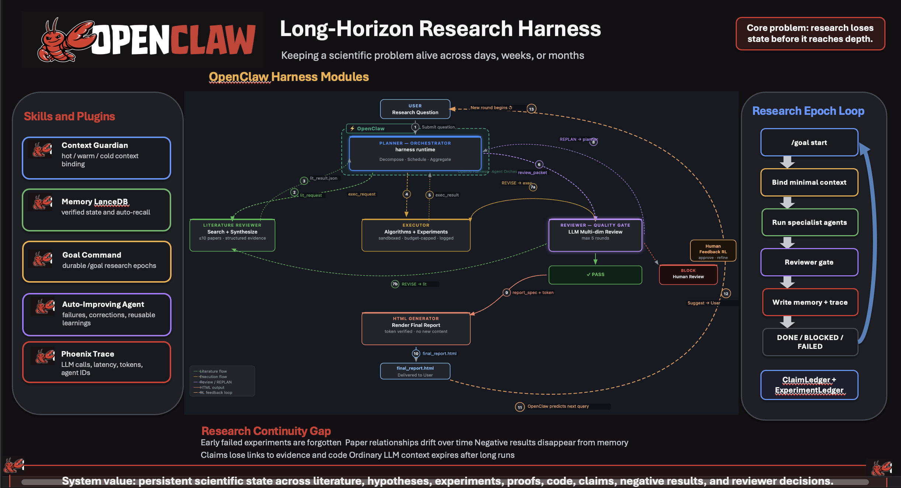

# Multi-Agent Hackathon：Long-Horizon-Research-Assistant-Harness




Workspace for a planner-centered OpenClaw multi-agent research assistant.

This repo is currently at the schema-first stage. The five JSON contracts in
`schemas/` define the planner state and worker outputs before any agent prompts
or OpenClaw runtime config are added.

## Repository Hygiene

This repository intentionally excludes:

- local API keys and model configuration files
- `.env` files
- OpenClaw/Codex local state
- the current scratch Python files in this folder
- virtual environments and generated Python artifacts

Use `.env.example` and `llm_config.example.json` as templates for local setup.

Task workspaces under `projects/` are ignored by Git because they can contain
user attachments, generated artifacts, and assessment context.

## Contracts

The initial implementation fixes these contracts:

- `schemas/state.schema.json`
- `schemas/literature_result.schema.json`
- `schemas/execution_result.schema.json`
- `schemas/review_result.schema.json`
- `schemas/report_spec.schema.json`

The architecture implied by these schemas is:

- the current OpenClaw agent is both `main` and the research planner.
- workers do not talk to each other.
- all worker outputs return to the OpenClaw planner as JSON artifact refs.
- plain "do research on ..." requests run the default reviewed HTML-report
  pipeline: `literature_reviewer` -> `executor` -> `reviewer` ->
  `pdf_generator`. Source-only requests may stop after `literature_reviewer`.
- human feedback is treated as report-scoping or report-revision input unless
  the user explicitly says otherwise.
- each OpenClaw session writes to a matching project workspace:
  `projects/<session_name>/`. Use the CLI `--session`, `--session-id`, or
  runtime session id as both `session_name` and planner `trace_id`.
- every worker invocation is traced under
  `projects/<session_name>/provenance/agent_trace.jsonl` and summarized in planner
  replies. `scripts/agent_trace.py` can append those traces and print
  CLI-visible `[Agent Trace]` lines.
- interactive OpenClaw sessions may use `sessions_yield` before long worker
  phases so role employment is visible before the final answer.
- the OpenClaw planner does not access the internet directly.
- internet-backed research is delegated to `role/literature_reviewer/`.
- `pdf_generator` can run only after `reviewer` returns `PASS` and issues a
  pass token bound to reviewed artifact hashes.
- `pdf_generator` is a legacy role name; it currently renders approved HTML
  reports through `role/pdf_generator/html_generator.py`.
- reviewer loops are capped at 5 rounds; round 5 becomes an explicit forced
  `PASS` with unresolved issues reported.
- default compliance mode is `study_assistant`.

## Role Workspaces

`openclaw/` describes the current OpenClaw agent. It is both the user-facing
main agent and the research planner.

`role/` contains concise, problem-agnostic Python workspaces for the executable
worker roles:

- `role/literature_reviewer/`
- `role/executor/`
- `role/reviewer/`
- `role/pdf_generator/`

Each role folder has a runnable Python module, `system_prompt.md`, `skills.md`,
and `mcp.json`. Most modules are intentionally small scaffolds so they can be
executed by OpenClaw roles and replaced later.

The reviewer role is now more concrete: it uses LLM-led judgment plus lightweight
scripts for packet preflight, artifact hashing, optional executor verification,
scope audit, review logging, route suggestion, and pass-token issuance.

The OpenClaw planner should employ these existing roles rather than create new
ones.

GitHub repository operations are allowed for the OpenClaw planner as operational
repo maintenance, not as general internet research. The planner owns repository
creation and maintenance when user input or planner state enables GitHub sync.
See `openclaw/github_setup.md`.

## Local Setup

```bash
python -m venv .venv
source .venv/bin/activate
cp .env.example .env
```

Fill `.env` with local credentials, then create local model config files from
the example as needed.

For the current setup, use OpenAI as the active local model config:

```bash
cp llm_config.example.json llm_config.json
set -a
source .env
set +a
openclaw models set openai/gpt-5.4-nano
```

`.env` and `llm_config.json` are ignored by Git because they can contain API
keys. Prefer `OPENAI_API_KEY` in `.env`; keep committed config files as
placeholders only.

## Running OpenClaw

Interactive terminal UI:

```bash
openclaw chat --local --session research-main --thinking low
```

Helper script equivalent:

```bash
scripts/openclaw_session.py start research-main
```

One-shot command:

```bash
openclaw agent --local --agent main --session-id research-main --thinking low \
  --message "Do research on finding a human-readable proof of the four colour theorem."
```

`openclaw agent` always needs `--message`; use `openclaw chat` or
`openclaw tui` for an interactive session.

Delete a named OpenClaw session:

```bash
scripts/openclaw_session.py delete research-main --dry-run
scripts/openclaw_session.py delete research-main
```

Add `--project` to also remove `projects/research-main/`.

## Next Step

Next integration step: wire the planner to create
`role/reviewer/workspace/inbox/review_packet.json`, call the reviewer role, and
only create `report_spec.json` when `review_report.json` has `decision == PASS`
and `pass_token.json` exists.
